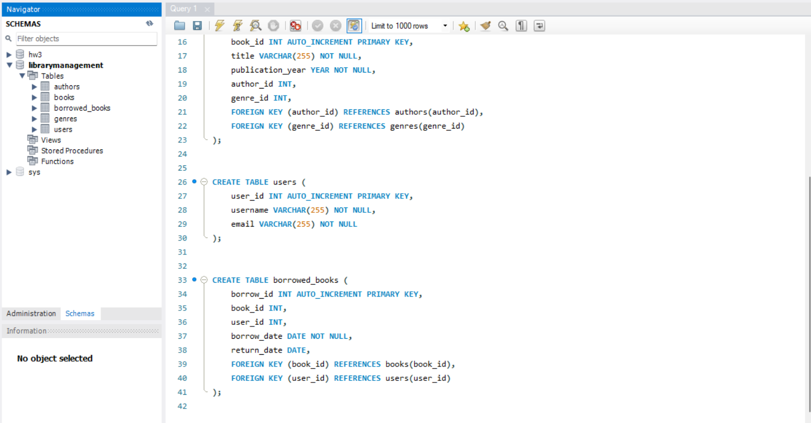
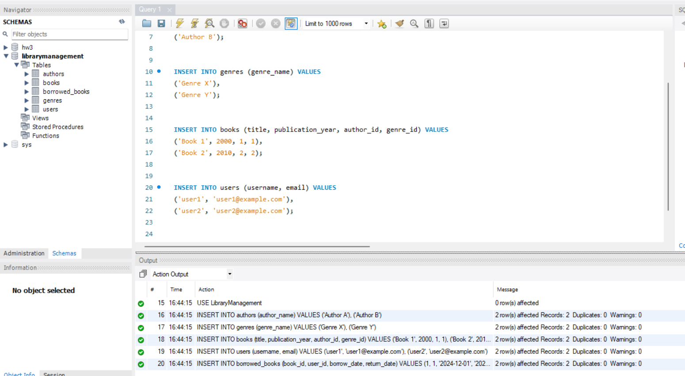
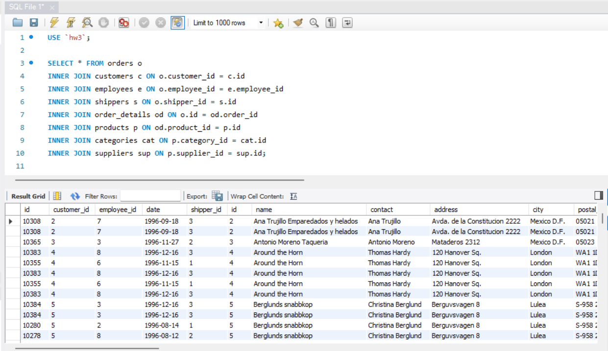
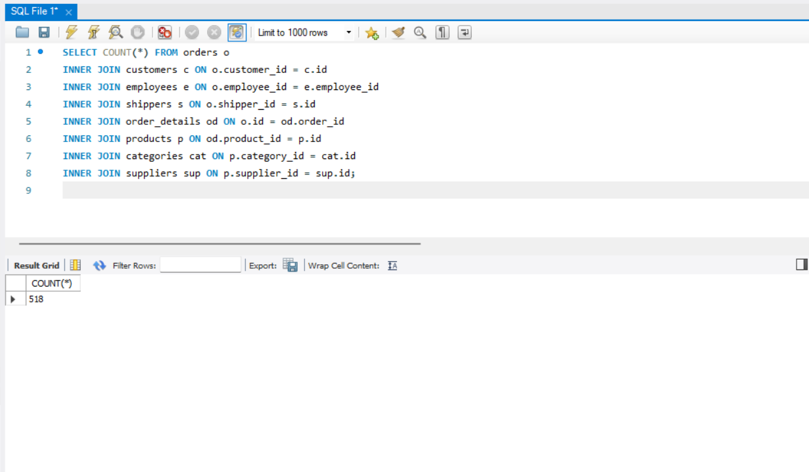
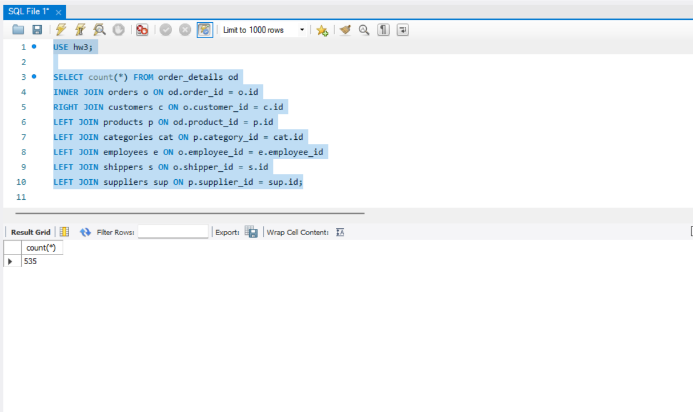
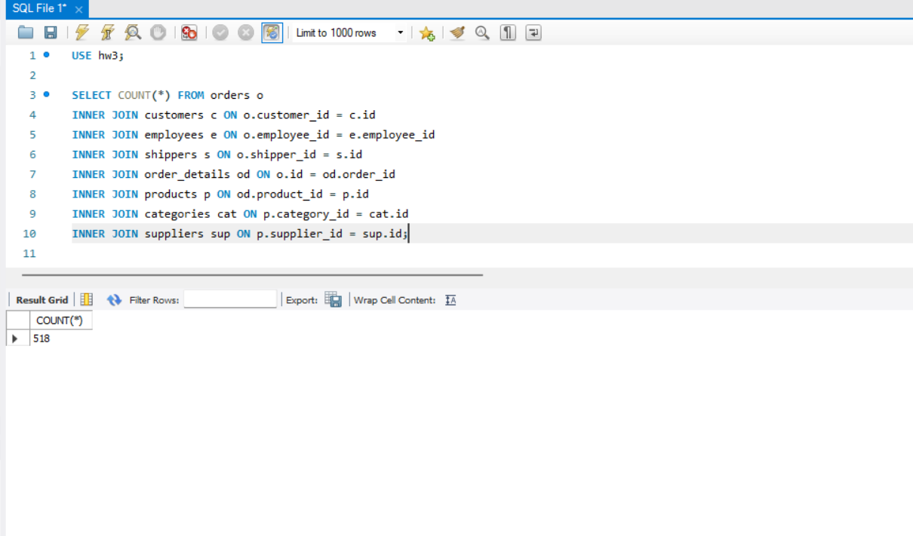
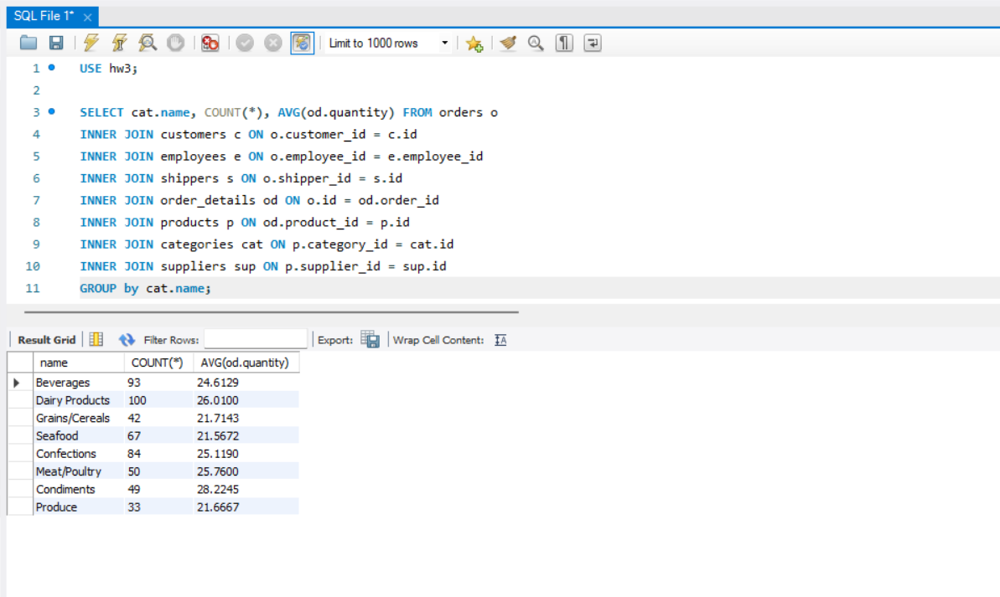
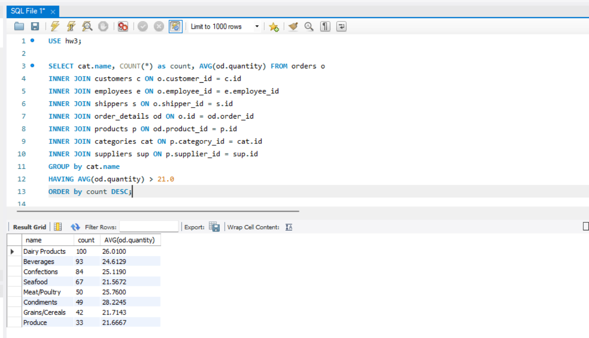
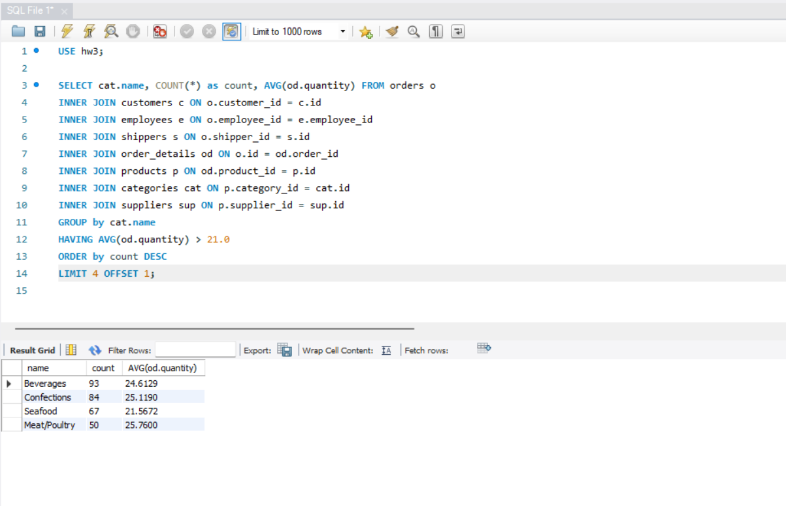

# goit-rdb-hw-04

## Task 1

Створіть базу даних для керування бібліотекою книг згідно зі структурою, наведеною нижче. Використовуйте DDL-команди для створення необхідних таблиць та їх зв'язків.

Структура БД

a) Назва схеми — “LibraryManagement”

b) Таблиця "authors":

author_id (INT, автоматично зростаючий PRIMARY KEY)
author_name (VARCHAR)
c) Таблиця "genres":

genre_id (INT, автоматично зростаючий PRIMARY KEY)
genre_name (VARCHAR)
d) Таблиця "books":

book_id (INT, автоматично зростаючий PRIMARY KEY)
title (VARCHAR)
publication_year (YEAR)
author_id (INT, FOREIGN KEY зв'язок з "Authors")
genre_id (INT, FOREIGN KEY зв'язок з "Genres")
e) Таблиця "users":

user_id (INT, автоматично зростаючий PRIMARY KEY)
username (VARCHAR)
email (VARCHAR)
f) Таблиця "borrowed_books":

borrow_id (INT, автоматично зростаючий PRIMARY KEY)
book_id (INT, FOREIGN KEY зв'язок з "Books")
user_id (INT, FOREIGN KEY зв'язок з "Users")
borrow_date (DATE)
return_date (DATE)

[Task 1](p1.sql)

## Task 2

Заповніть таблиці простими видуманими тестовими даними. Достатньо одного-двох рядків у кожну таблицю.

[Task 2](p2.sql)

## Task 3

Перейдіть до бази даних, з якою працювали у темі 3. Напишіть запит за допомогою операторів FROM та INNER JOIN, що об’єднує всі таблиці даних, які ми завантажили з файлів: order_details, orders, customers, products, categories, employees, shippers, suppliers. Для цього ви маєте знайти спільні ключі.

[Task 3](p3.sql)

## Task 4

### Виконайте запити, перелічені нижче.

- 4.1 Визначте, скільки рядків ви отримали (за допомогою оператора COUNT).
  
  [4.1](p4.1.sql)

  

- 4.2 Змініть декілька операторів INNER на LEFT чи RIGHT. Визначте, що відбувається з кількістю рядків. Чому? Напишіть відповідь у текстовому файлі.

    [4.2](p4.2.sql)

    

- 4.3 Оберіть тільки ті рядки, де employee_id > 3 та ≤ 10.
  
    [4.3](p4.3.sql)

    

- 4.4 Згрупуйте за іменем категорії, порахуйте кількість рядків у групі, середню кількість товару (кількість товару знаходиться в order_details.quantity)

    [4.4](p4.4.sql)

    

- 4.5 Відфільтруйте рядки, де середня кількість товару більша за 21.

    [4.5](p4.5.sql)

    

- 4.6 Відсортуйте рядки за спаданням кількості рядків.

    [4.6](p4.6.sql)

    

- 4.7 Виведіть на екран (оберіть) чотири рядки з пропущеним першим рядком.

    [4.7](p4.7.sql)

    